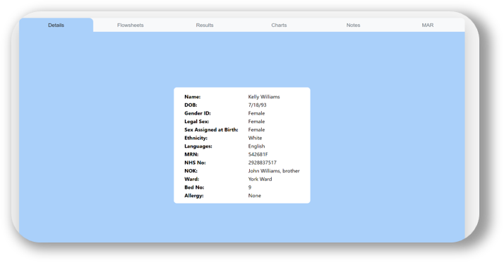

<p align="center">
  
</p>

# EPR

EPR is a browser-based simulated patient record system for teaching and
simulation delivery. It shows a patient list, opens a tabbed patient folder view
(Details, Flowsheets, Results, Charts, Notes, MAR), and now stores everything in
a small local database instead of per-patient Excel workbooks and folders.

There are two URLs:

| URL | Purpose |
| --- | --- |
| `http://<host>:8080/` | **Viewer** - read-only patient record, used during scenarios. |
| `http://<host>:8080/admin/` | **Admin** - same views with editable cells; create/edit/delete patients, edit every tab, upload and remove documents. |

All edits are made in the admin interface. There are no Excel files and no
user-accessible patient folders.

## Setup

You need **Docker Desktop** (<https://www.docker.com/products/docker-desktop/>) —
nothing else, not this repository or a GitHub account.

With Docker Desktop installed and running, open a terminal and run:

```
docker run -d --name epr -p 8080:8080 -v epr-data:/data --restart unless-stopped ghcr.io/gareth-power/epr:latest
```

That pulls the image from GitHub and starts it. Open:

- <http://localhost:8080/> — viewer
- <http://localhost:8080/admin/> — add and edit patients (empty on first run)

Other computers on the same network use `http://<your-computer's-ip>:8080/`.

**Update:**

```
docker pull ghcr.io/gareth-power/epr:latest
docker rm -f epr
docker run -d --name epr -p 8080:8080 -v epr-data:/data --restart unless-stopped ghcr.io/gareth-power/epr:latest
```

Patient data lives in the `epr-data` volume and is untouched by updates; schema
changes migrate automatically.

- **Stop:** `docker rm -f epr`, or the Stop button in Docker Desktop.
- **Different port:** change `-p 8080:8080` to e.g. `-p 9000:8080`.

> **No authentication** — the admin URL is open to anyone who can reach the
> computer on the network. Use only on an isolated simulation network (see the
> disclaimer at the end).

### From a checkout instead

If you have cloned or downloaded the repo, `docker compose up -d` does the same
thing via `docker-compose.yml` (data goes in a `./data` folder beside it); add
`--build` to build from source instead of pulling.

**Synology (Container Manager):** create a Project, paste `docker-compose.yml`,
point the volume at a shared folder, set `PUID` / `PGID` to your DSM user, and
use `"8095:8080"` for the port if 8080 is taken.

## Code vs. data

The **code** (this repo / the Docker image) and the **deployment data** are kept
completely separate. Everything specific to a running instance lives under one
directory, `$EPR_DATA_DIR` (default `./data`, `/data` in Docker):

```
$EPR_DATA_DIR/
  epr.db               SQLite database (patients, sheets, file metadata)
  epr.db-wal, -shm
  files/<patient_id>/   uploaded documents
  changes.log           audit log
  backups/              automatic snapshot of epr.db before each schema upgrade
```

The server never writes outside that directory, so **replacing the code (a new
image, a `git pull`) never touches patient data**, and a copy of `$EPR_DATA_DIR`
is a complete backup.

```
db.py                Data-directory paths, DB connections, schema migrations
server.py            Flask app: serves the UI + JSON API
migrations/*.sql      Numbered schema steps; applied automatically on start
app/                 The front-end (viewer + admin, one set of files)
scripts/import_legacy.py   Reference: the one-off importer used to migrate the
                           original Patients/ Excel tree into the database
Dockerfile, docker-compose.yml, docker/entrypoint.sh
```

Schema changes ship as new `migrations/NNNN_*.sql` files. On startup the server
compares `PRAGMA user_version` to the newest migration; if the database is
behind it snapshots `epr.db` to `backups/` and applies each pending step in its
own transaction. A brand-new database is just built from step 0001.

Each patient has a row in `patients` (name + free-form `meta`), five rows in
`sheets` (`details` / `flowsheets` / `results` / `notes` / `mar`, each a JSON
2-D grid), and zero or more `files` rows.

## Run without Docker

- Python 3.9+ and Flask (`pip install -r requirements.txt`).

```
python3 -m venv .venv && .venv/bin/pip install -r requirements.txt
.venv/bin/python server.py            # EPR_DATA_DIR / EPR_PORT / EPR_HOST env, or --port / --host
```

## Legacy import (reference only)

`scripts/import_legacy.py` was used once to migrate the previous Excel-based
system (`Patients/<name>/information.xlsx` + `patients.csv`) into the database.
It is not part of normal use. To re-run it against a copy of an old folder:

```
python3 scripts/import_legacy.py --source /path/to/Patients [--force]
```

## Using the admin interface

- **Patient list** (`/admin/`): "New Patient" (name + list fields), "Edit",
  "Delete".
- **Details**: label column is fixed (Name, DOB, Gender ID … Allergy). Edit the
  values; "+ Detail" adds an extra row you can name and delete.
- **Flowsheets**: the standard observation rows (Respiratory Rate, SpO2, …) are
  locked. Edit values, set the time-column headers, "+ Time column" /
  "- Time column", and "+ Observation" for extras (e.g. PEWS, Weight).
- **Results**: full grid - add / remove test rows, edit reference ranges and
  values, add result columns. New patients start from the standard adult panel.
- **MAR**: the 7-row drug block (Drug, Start Date, Duration, Prescriber, Dose,
  Route, Freq) is locked and repeats. "+ Add drug" / "✕" work on whole blocks;
  "+ Day column" / "- Day column" manage the date columns.
- **Notes**: "New Note", edit department / date / body, "Save", "Delete note".
- **Charts**: upload an image or PDF, or delete one. Uploaded files appear in the
  viewer immediately.

Every editor has a **Save** button; nothing is written until you press it.

## Change log

Every change made through the admin interface is recorded:

- **What**: patient created / renamed / deleted, list-field changes, and every
  edited cell (`"Potassium" / "Today": "4.3" -> "5.8"`), plus added/removed rows
  and columns. File uploads/removals are logged too.
- **Who**: opening `/admin/` shows a blocking prompt for your name (stored in that
  browser, changeable from the toolbar afterwards). It is sent with every change.
  The client IP is always recorded too.
- **Where**: appended to `$EPR_DATA_DIR/changes.log`, one tab-separated line per
  change with the columns `timestamp`, `editor`, `ip`, `action`, `patient`,
  `sheet`, `detail`. View it in the browser at **`/admin/history.html`** ("Change
  log" in the admin toolbar), which has a filter box.

The log is append-only and never rotated automatically; archive or trim
`changes.log` yourself if it grows large. It is not a substitute for backups,
but it makes an accidental edit easy to spot and undo by hand.

Viewer behaviour is unchanged: Results and Charts refresh every few seconds;
Flowsheets "Add Entry" and MAR time entry are still session-only and are not
saved back.

## Add a new patient

Use **New Patient** in `/admin/`. Details, Flowsheets, Results and MAR are
pre-seeded with the standard templates (defined in `server.py` by
`sheet_template()` and the `*_STANDARD_*` lists), so those tabs are never empty.
Open the patient and fill in the values.

## Backup

The whole system state is the data directory (`epr.db`, `files/`, `changes.log`,
`backups/`). It can be copied while the server runs (WAL mode).

- **`docker run` quick start:** it's in the `epr-data` volume. Save a copy with
  `docker run --rm -v epr-data:/data -v "$PWD":/out alpine tar czf /out/epr-backup.tgz -C /data .`
  (Docker Desktop can also browse and export volumes from the **Volumes** tab).
- **From a checkout / Synology:** copy the `data` (or mounted shared) folder.

## Third-party components

The front-end uses no third-party JavaScript. The server depends only on Flask
(BSD-3-Clause) and its transitive dependencies (Werkzeug, Jinja2, Click,
MarkupSafe, itsdangerous, Blinker), installed from PyPI at build time and not
vendored into this repository. The Docker image also bundles `tini` and `gosu`.

## License

Source code: GNU Affero General Public License v3.0 only. See `LICENSE`.

## Disclaimer

For educational use only. Not for clinical or diagnostic use.

This software is intended for simulation, training, and teaching scenarios. It
must not be relied on for real patient care, clinical decision-making, diagnosis,
treatment, medication administration, or operational hospital record-keeping.

If this software is to be run on NHS trust networks, hospital-managed devices, or
any other healthcare organisation infrastructure, the deploying team is
responsible for obtaining all appropriate local approvals before use. This may
include, where required by the host organisation, sign-off from digital,
information governance, cyber security, clinical safety, simulation leadership,
medical device, and/or IT operations teams.

Because the admin interface has no authentication and the server binds to the
local network, it is strongly recommended that this software is hosted on a
small, isolated network separate from core trust infrastructure. At the
Simulation and Interactive Learning Centre (SaIL) it is hosted on a
non-internet-connected local area network used for simulation delivery only.

Before any use in a hospital environment, teams should complete their own local
review of network hosting and firewall requirements, access control and endpoint
security, the suitability of the content stored on the host, whether any real
patient information is present or could be introduced, local information
governance and data protection requirements, and local clinical safety, risk
assessment, and operational approval processes.

Each deploying organisation remains responsible for ensuring that use of this
software is lawful, locally approved, appropriately secured, and suitable for its
intended simulation environment.
